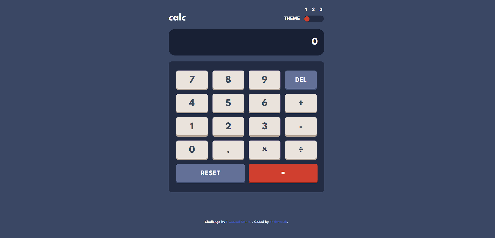
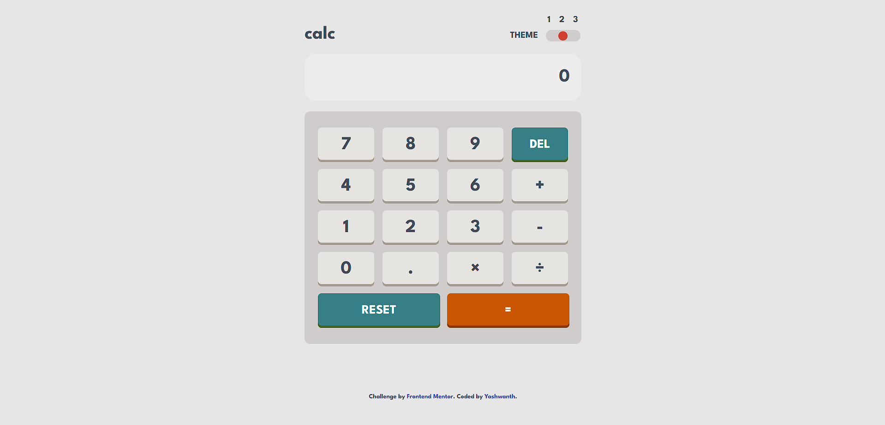
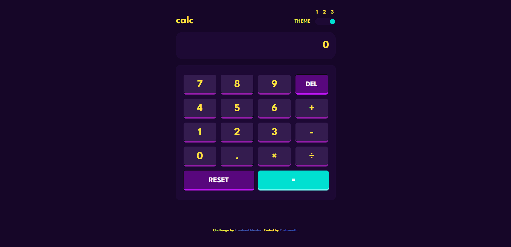
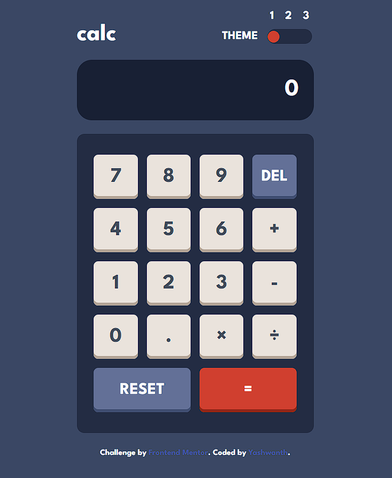
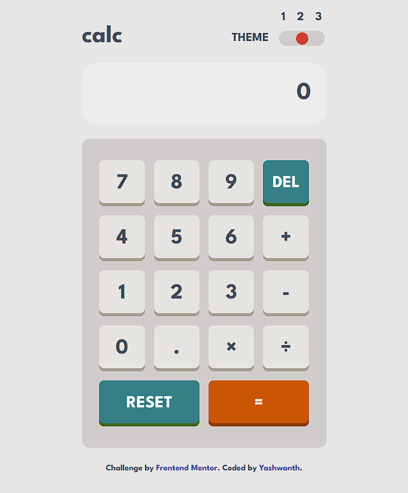
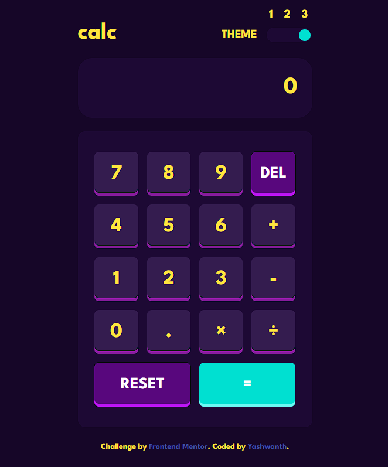

# Frontend Mentor - Calculator app solution

This is a solution to the [Calculator app challenge on Frontend Mentor](https://www.frontendmentor.io/challenges/calculator-app-9lteq5N29). Frontend Mentor challenges help you improve your coding skills by building realistic projects.

## Table of contents

- [Overview](#overview)
  - [The challenge](#the-challenge)
  - [Screenshot](#screenshot)
  - [Links](#links)
- [My process](#my-process)
  - [Built with](#built-with)
  - [What I learned](#what-i-learned)
  - [Continued development](#continued-development)
  - [Useful resources](#useful-resources)
- [Author](#author)
- [Acknowledgments](#acknowledgments)

## Overview

### The challenge

Users should be able to:

- See the size of the elements adjust based on their device's screen size
- Perform mathmatical operations like addition, subtraction, multiplication, and division
- Adjust the color theme based on their preference
- **Bonus**: Have their initial theme preference checked using `prefers-color-scheme` and have any additional changes saved in the browser. Since this is a concept I'm yet to learn, I shall use this any of the projects I'll be doing in the future.

### Screenshot

### Links

- Solution URL: https://github.com/yashwanth-srinivasa/calculator-front-end-mentor
- Live Site URL: https://calc-multi-theme.netlify.app/

## My process

### Built with

- Semantic HTML5 markup
- CSS custom properties
- Flexbox
- CSS Grid
- Mobile-first workflow
- Vanilla JavaScript
- SASS as CSS preprocessor

### What I learned

I've learnt how to use:

1. SASS mixins for media queries.
2. The BEM approach to naming elements of a page.
3. SASS functions.
4. DOM Manipulation in JavaScript to change theme, get values off of the buttons and displaying the changed text in the calculator display.

### Continued development

In future projects where theme of a page is essential, I would like to use:

1. prefers-color-scheme to check what the user has selected in their browser to automatically set a theme.
2. use localStorage to store the state of a theme for better UX.

### Useful resources

- [Learn CSS Grid, by Slaying the Dragon](https://www.youtube.com/watch?v=EiNiSFIPIQE) - Gave a crash course in using the CSS grid. Served as a very nice revision.
- [Learn FlexBox in 8 minutes, by Slaying the Dragon](https://www.youtube.com/watch?v=phWxA89Dy94) - Easy to understand and I came back to this again and again throughout the project.
- [Sass and BEM for beginners by Coder Coder](https://www.youtube.com/watch?v=jfMHA8SqUL4) - A very good introduction to using SASS and BEM methods; uses Watch SASS extension in VSCode which is kind of out-of-date but still relevant enough.

## Author

- Frontend Mentor - [@yashwanth-srinivasa](https://www.frontendmentor.io/profile/yashwanth-srinivasa)
- GitHub - [yashwanth-srinivasa]([Sass and BEM for beginners by Coder Coder](https://www.youtube.com/watch?v=jfMHA8SqUL4))
